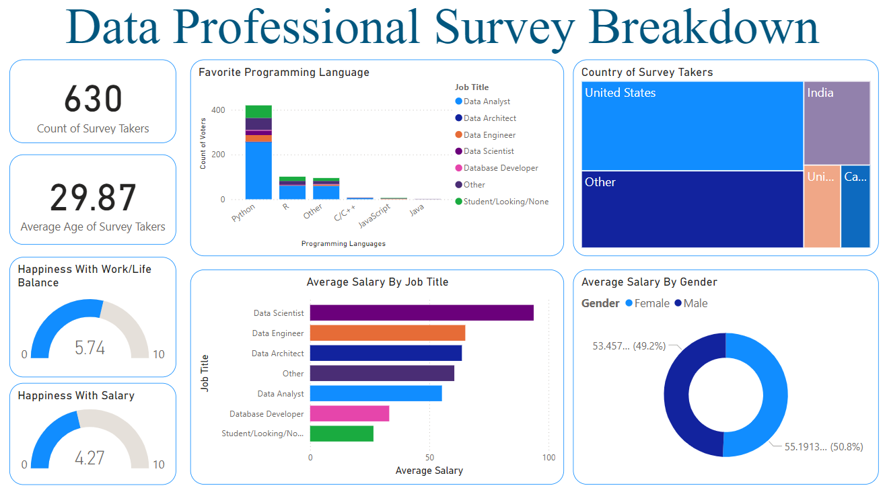

# Data Professional Survey Breakdown Dashboard

## Overview
This repository contains a Power BI project that analyzes survey data collected from data professionals. The survey aimed to explore aspects such as job roles, salaries, preferred programming languages, work-life balance, and demographic information.

## Dashboard Preview


## Features

The Power BI dashboard provides the following insights:

1. **General Overview**:
   - Count of survey takers.
   - Average age of survey takers.

2. **Job Titles and Salaries**:
   - Average salary by job title (e.g., Data Scientist, Data Engineer, Data Analyst).

3. **Programming Language Preferences**:
   - Breakdown of survey takers' favorite programming languages.

4. **Work-Life Balance and Salary Happiness**:
   - Average ratings for work-life balance and salary satisfaction.

5. **Geographic Distribution**:
   - Representation of survey takers by country using a tree map visualization.

6. **Gender and Salary**:
   - Comparison of average salary by gender.

7. **Difficulty in Entering the Field**:
   - Distribution of responses for difficulty in entering the data field.

## Project Details

### Dataset
The dataset used for this project is included in the repository:
- `Data Professional Survey Dataset.xlsx`: Raw survey data collected via an online form.

### Transformations
The data was cleaned and transformed using Power BI's Power Query Editor:
- Columns with free-text responses (e.g., job titles, programming languages) were standardized.
- Salary ranges were averaged for better usability in visualizations.
- Non-numeric data was formatted appropriately.

### Visualizations
The dashboard includes:
- Cards for quick stats.
- Bar and column charts for categorical breakdowns.
- Tree maps for geographic distribution.
- Donut charts for gender breakdown.
- Gauges for satisfaction metrics.

## How to Use

1. **Prerequisites**:
   - Install [Power BI Desktop](https://powerbi.microsoft.com/).

2. **Clone the Repository**:
   ```bash
   git clone https://github.com/niksom406/Data-Professional-Survey-Breakdown-Dashboard-Powerbi.git
   ```

3. **Open the Power BI File**:
   - Open `Data Professional Survey Breakdown Dashboard.pbix` in Power BI Desktop.

4. **Explore the Dashboard**:
   - Use the interactive filters and slicers to explore various insights.

5. **Customize**:
   - Modify the visuals, color themes, and data transformations as needed.

## Files in the Repository

- `Data Professional Survey Breakdown Dashboard.pbix`: Power BI project file.
- `Data Professional Survey Dataset.xlsx`: Raw survey data.
- `Dashboard.png`: Screenshot of the final dashboard.

## Potential Improvements
- **Advanced Cleaning**: Further standardization of job titles, programming languages, and demographic data.
- **Additional Visualizations**: Incorporate more insights, such as salary trends by age group.
- **Data Enrichment**: Include external datasets (e.g., cost of living by country) for deeper analysis.
